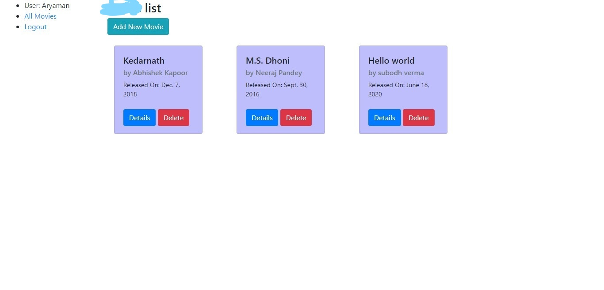
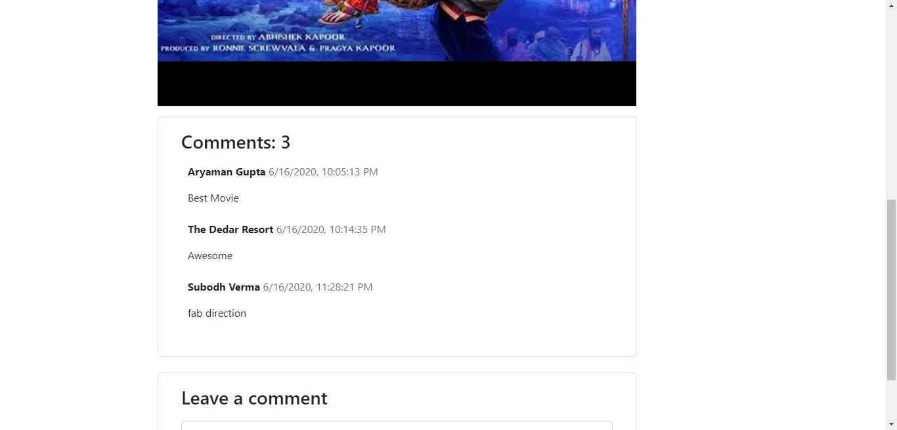

# Movies-Reviews 

**Site is deployed on** https://movies-reviews-atpug22.herokuapp.com **.**

### Tasks
 - [x] All Movies Grid View 
 - [x] Movie Details and Movie Play
 - [x] User can add Comment and can view all other users comments
 - [x] Only admin can add,delete and update movie

### Photos

### Functionality
In this project we can Google Login or register and login. When We login we can see the list of movies after clicking on all movies and we can then see the details on clicking details button on movies-list page. We can watch the movie in movie-details page and then can add comment. 
Only Superuser can add new movie from add new movie button on movies-list page and can also delete the movie. He can also update the movie data.
I took me approx 5 hours to make backend of this project.
